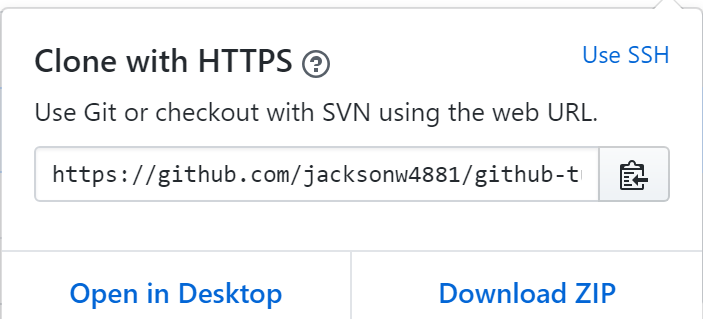

# GitHub Tutorial

_by Jackson Wu_

---
## Git vs. GitHub:

* **Git:** A version control to track your changes.  
  * **Git is not required for github**
  * **Runs in Command Line**
  * **Git is used in a local repositiory** 
   

* **Github:** A website that works using git that holds your code. 
   * **Git is required for github**
   * **Used to collaborate on files with other people**
   * **Github holds and stores changes you've made**

---
## Initial Setup:
    
**_How to create a github account_**: 

1. Go to Github.com [here](http://github.com).
2. Click "sign up" on the top right hand corner.

3. Create a username for the username section (If you're an HSTAT student, put in your HSTAT email without the @hstat.org).
4. Put your email in the email section (Your own personal email or your school's email).
5. Create a password (Something easy to remember, like your student ID number).

6. Verify your account by playing the puzzle
7. Click "continue".
8. Choose the free plan or the paid plan that costs $7.

9. Click "continue".
10. Complete the survey and click "submit" (Or skip the survey by clicking "skip this step").

_Voila! You've just created your GitHub account_ :) 

**Once you've created your GitHub account, you'd need to link an SSH Key from Cloud 9 to GitHub. An SSH key is used to keep your files secure and is used to connect the local repository to the remote repository.**

**_How to link an SSH Key from Cloud 9 to GitHub (Assuming you're using Cloud 9 for your IDE):_**

1. Go to your Cloud 9 dashboard.
2. Click on the gear icon on the top right corner.

3. Click on the SSH Keys on the left hand side.

4. Copy your second SSH key (Should start with ssh-rsa and a whole bunch of letters and numbers).
5. Go to your GitHub dashboard on Github.com.
6. Click on your profile icon on the top right corner and click on setting.

7. Click on "SSH and GPG keys" on the left hand side.

8. Click on "New SSH Key".

9. Put a title for the title section.
10. Paste in your key in the key section.
11. Click "add SSH key".

12. Go to your Cloud 9 terminal and type in "ssh -T git@github.com" and enter. If you've done it successfully, it should say "Hi (your username)! You've successfully authenticated, but GitHub does not provide shell access."


_Voila! You've just linked your SSH key from cloud 9 to GitHub_ :)

---
## Repository Setup:

**Once you've created your GitHub account and linked your SSH Key, you'd need to create a repository on GitHub. GitHub holds remote repositories that can be used to store your files and store changes to those files.**

**_How to create a repository on GitHub:_**

1. Go to Github.com [here](http://github.com).
2. Click on the plus icon on the top right corner.
3. Click on "New Repository".

4. Add a name for your repository (And a description if you'd like).
5. Click "Create repository".

6. If it's on HTTPS, change it to SSH. If it's already on SSH when you've created the repository, leave it.
  

**After creating your repository, you have to send your changes you've done on your file(s) from Cloud 9 to your remote repository on GitHub.**

**_How to create, add, commit and push your file to GitHub:_**

1. Go to your Cloud 9 terminal.
2. Type and enter ```mkdir (reponame)``` to create a directory (Make sure you're currently on ~/workspace) and then type and enter ```cd reponame``` to move to that directory.
3. Type and enter ```touch README.md``` to create a README file within that directory and then type and enter```git init``` to initalize git within that directory.
4. Open and edit your file (optional).
5. Type and enter```git add README.md``` to add your file to the staging area.
6. Type and enter```git commit -m "(a commit message)"``` to commit that file.
7. Go back to Cloud 9 and copy, paste and enter ```git remote add origin git@github.com:username/reponame.git``` from your github repository onto your c9 terminal.
8. Afterwards, copy, paste, and enter ```git push -u origin master``` from your github repository onto your c9 terminal.
 
_Voila! You've just created your first repository and pushed your changes to your remote repository_ :)

---
## Workflow & Commands:

**After you've created your first repository and whatnot, you'll have to know the difference between the working directory, staging area, and repository. You'd also have to know some commands in order to use Git and GitHub properly.**

* **_Difference between working directory, staging area, and repository:_**

  * **Working Directory:** The place where you'll be editing your files.
  * **Staging Area**: The place where files are added to be committed.
  * **Repository**: The place where all your changes are saved and stored as commits.  

    * **Local repository**: Directories on Cloud 9 
    * **Remote repository**: Repositories on GitHub 
* **_Important Command Line Commands_**:
  * ```↑ up arrow```: Views the previous commands you've typed. (Makes it easier to use a command you've already did rather than typing the command)
  * ```tab```: Automatically completes a name you want to type if it's unique.
  * ```clear```: Clear all the commands you've made on your terminal but doesn't delete them.
  * ```Control K```: Permanently deletes all the commands you've made on your terminal but doesn't revert the action.
  * ```~```: The root. You can use ```cd ~/workspace``` and automatically be in that directory regardless of what directory you're currently in.
  * ```..```: Used in conjunction with ```cd``` to move up one directory.
  * ```/```: Used at the end of ```cd``` to navigate to another directory easier.
    * If you're still confused, imagine this file tree structure:
      * nyc
        * brooklyn
          * bay-ridge
          * park-slope
        * manhattan
        * queens 
        * the-bronx
        * staten-island
    * You're currently at the bay-ridge directory and want to change to the nyc directory. You could use ```cd brooklyn``` and then ```cd nyc``` or ```cd ..``` twice, but we're too lazy and time is valuable. Instead, we could use ```cd brooklyn/nyc``` or ```cd../..``` to navigate to the nyc directory as a way to save time and energy.
  * ```cd```: Changes directories that are adjecent to each other. (Cannot be used to move to another directory that is not adjecent to the directory you're currently in unless you use ```/``` or ```cd ~/workspace```)
  * ```ls```: List files in a directory.
  * ```mkdir```: Makes a new directory.
  * ```rmdir```: Removes a directory (Cannot be used if there is a file(s)/content within the directory)
  * ```touch```: Creates a new file
  * ```rm```: Removes a directory
  * ```rm -rf```: Forcibly removes all the contents in a directory and the directory itself.
  * ```mv (existing name) (new name)```: Renames a file or directory
  * ```mv (existing name) (old name)```: Moves a file or directory
  * ```c9 file```: Opens a file on cloud 9```

* **_Important Git Commands:_**  
  * ```git status```: Tells you which files were added to the staging area, which weren't, and which files are ready to be commited.
  * ```git init```: Initalizes git in a directory. This command allows you to utilize other git commands.
  * ```git add filename```: Adds a file to the staging area.
  * ```git add .```: Adds all new and modified files to the staging area. (Excludes deleted and renamed files)(Tip: If you're really lazy like me and don't feel like typing the first letter of your file and ```tab``` to add a file, just use ```git add .``` as a shortcut)
  * ```git add --all```: Adds all new, modified, deleted and renamed files to the staging area
  * ```git commit -m "message"```: Takes a "snapshot" of a file that was added to the staging area and saves the changes. The message is used to differentiate between different changes in the file.
  * ```git remote add origin URL```: Creates the "bridge" that connects the local repository to the remote repository to push your commits. (**Only needed to be used once when you've first made your remote repository and want to push your commits to your remote repository**).
    * **git -** The git command.
    * **remote -** Sets up the connection between the local repository. and the remote repository.
    * **add -** Adds the remote repository.
    * **origin -** Nickname for the remote repository.
    * **URL -** The URL to the remote repository. Could be in HTTPS or SSH. (It should be in SSH)
  * ```git push -u origin master```: Pushes changes from your local repository to your remote repository. (**Only needed to be used once after using ```git remote add origin URL```. To push more commits you've made after that, use ```git push```**).
    * **git -** The git command.
    * **push -** Sends the commits from the local repository to the remote repository.
    * **-u -** The "u" stands for upstream. This will make the terminal remember which specific remote repository to push your changes to. In the future, you can use ```git push```.
    * **origin -** The specific remote repository you're pushing to.
    * **master -** The branch in your remote repository that contains your own commits you've pushed.
    
  * ```git push```: Pushes your changes from your local repository to your remote repository (**Can only be used to files that had been committed**).
  
**You'd have to do these series of commands on your terminal to push your changes to the remote repository if you're pushing for the first time, in chronological order:**

1.```git init``` (If you haven't already)  
2.```git add filename``` (Can be replaced with  ```git add .``` or ```git add --all``` depending on the situation)  
3.```git commit -m "message"```   
4.```git remote add origin URL```  
5.```git push -u origin master```

**If you've already pushed your changes to your remote repository and want to push another change, you'd have to do these series of commands on your terminal, in chronological order:**

1.```git add filename``` (Can be replaced with  ```git add .``` or ```git add --all``` depending on the situation)   
2.```git commit -m "message"```   
3.```git push``` 

---
## Rolling Back Changes:

**On rare occasions, you'll make some sort of mistake on a file and want to revert back to its previous state. To explain this as clear and concise as I possibly can, I'll try to explain it in a form of a question and answer it.**

> **Q:** I've accidently edited the wrong file and want to undo all of my edits. What do I do?

**A:** Use ```git checkout -- filename```  to undo the edits.

> **Q:** I've accidently added my file to the staging area and want to undo that action. What do I do?

**A:** Use ```git reset HEAD filename``` to unstage the file.

> **Q:** I've committed my file but accidently used the wrong commit message. How do I undo my commit?

**A:** Use ```git reset --soft HEAD~1``` to undo your commit.

> **Q:** I've successfully edited my file but didn't intend to add and commit that file. How do I undo the adding and the committing I've just did?

**A:** Use ```git reset HEAD~1``` to undo your adding and committing.

> **Q:** I've accidently edited, added, and committed the wrong file. How do I undo everything to the point where the file reverted back to what it was originally was?

**A:** Use ```git reset --hard HEAD~1``` to reset everything to what it was originally was as if you've just opened the file.

> **Q:** I've accidently pushed my commits to my remote repository. How do I undo my push?

**A:** Use ```git revert SHA``` to undo the push. The ```SHA``` is a series of numbers and letters that are located next to your commit when you use ```git log``` on your cloud 9 terminal. (To exit git log on cloud 9, press the **q** key)

---
## Error handling:

> **Q:** What to do if you did ```git init``` in the wrong directory?

**A:** Use ```rm -rf .git``` in **that directory specifically. If you use it in a different directory, git will not be uninitalized on the directory you want to uninitalize.**

> **Q:** How do I know if I uninitalized git?

**A:**   
1. Use ```ls -a``` on the directory you want git to uninitalize. This command will lists all files (including hidden files). If ```.git``` was listed, git is currently initalized and if it's not, git is not initalized in that directory.
2. On Cloud 9, next to your directory on your terminal, if it shows ```(master)```, git is currently initalized and if it doesn't, git is not initalized in that directory.

_**How to completely remove a repository on your local:**_

1. Go to your Cloud 9 terminal.
2. Use ```rm -rf``` to remove all the content in a directory and the directory itself or use ```rmdir``` to remove an empty directory.

_**How to completely remove a repository on your remote:**_

1. Go to Github.com [here](http://github.com).
2. Click on your profile icon on the top right and corner and then click on "your repositories".

3. Click on the repository you intend to delete.
4. Click on "Settings".  

5. Scroll down until you see "Danger Zone".
6. Click "delete this repository".

7. Type in the name of your repository you intend to delete.
8. Click "I understand the consquences, delete this repository".


---
## Collaboration:

**Sometimes, You'd have to work with someone and have to share files, make changes to those files, etc.**

**Forking** creates a duplicate copy of a remote repository for you so that you can freely experiment with it. If you push any commits from your local to your forked repository, the changes will only go towards your forked repository and not the original repository.

**Cloning** allows you to take the files from your remote repository and transfer it down to your local repository so that you could modified the files.

```git pull```: Pulls all the changes on a file from your remote repository to your local repository.


**Pull Requests:** If you'd changed a file on your forked repository and want those changes to be on the original repository you forked, do pull requests. However, pull requests can be denied if the owner of the original repository doesn't want your changes to be on their repository.

**Approved pull request:** Your changes will go towards the original repository.

**Denied pull request:** Nothing happens to the original repository.

**_How to fork, clone and do a pull request:_**

1. Have your partner or whatever send you a link to their repository.
2. Click on the "Fork" icon on the top right hand side.

3. Wait for your forked repository to load.
4. From there, click on the green "Clone or download" button.

5. If it's on HTTPS change it to SSH but if it's already on SSH when you'd clicked on the green button, leave it.
6. Click on the "Clipboard" icon next to the link.

7. Type in ```git clone``` and then paste the SSH onto your Cloud 9  terminal (Make sure you're currently on ~/workspace).

8. Edit a file or files and then type and enter ```git add filename``` (Can be replaced with ```git add .``` or ```git add --all``` depending on the situation), ```git commit -m "message"```, and ```git push```. 
9. Go to your forked repository and click on "New pull requests".
10. Click on the green button that says "Create pull request".
11. Have your partner approve the pull request (Hopefully).
